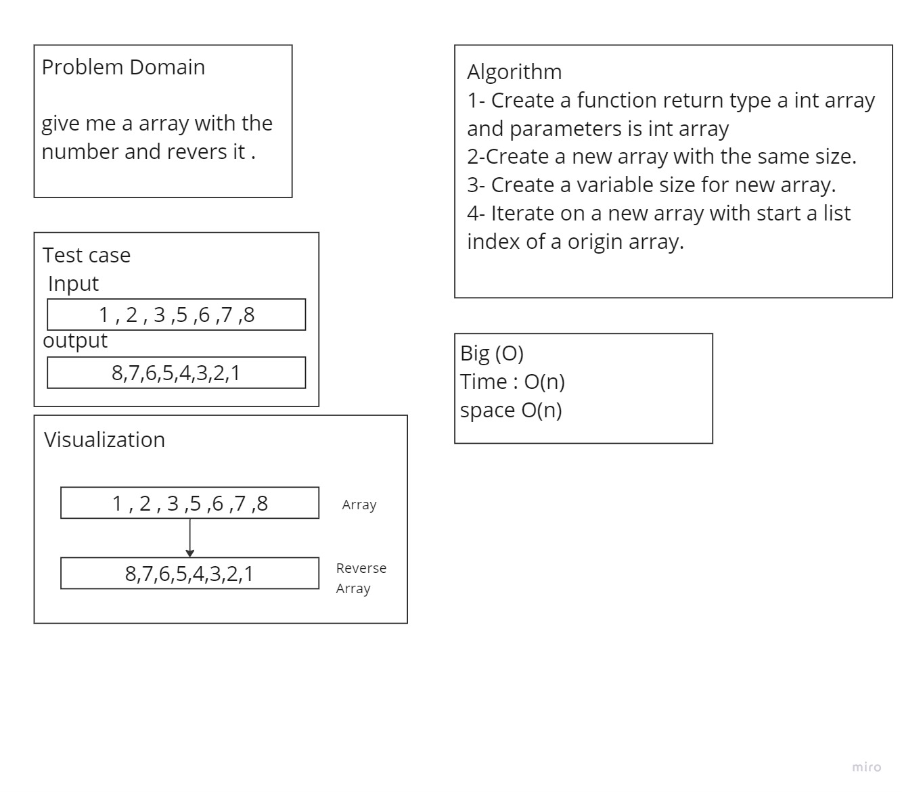

# Challenge Title
Reverse-Array

## Whiteboard Process

## Approach & Efficiency
**Algorithm**
1- Create a function return type a int array and parameters is int array
2-Create a new array with the same size.
3- Create a variable size for new array.
4- Iterate on a new array with start a list index of a origin array.
## Solution

