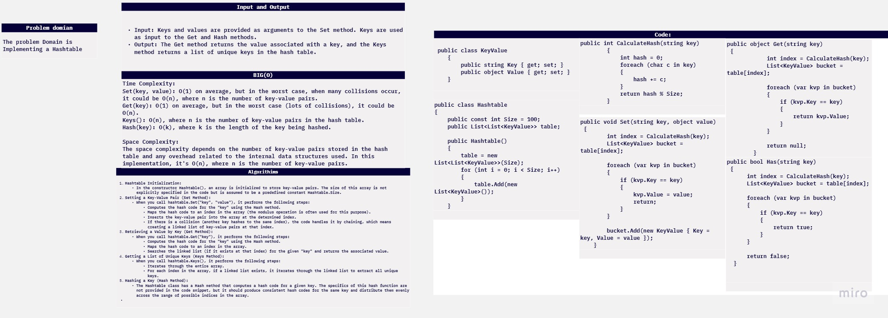
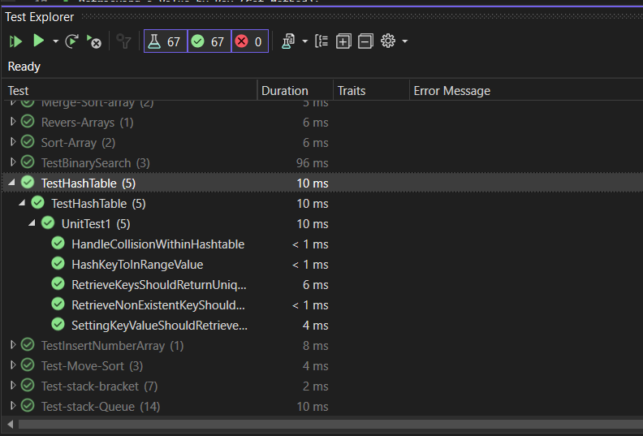

# challenge : Hash Tables
## explanation
 the code demonstrates the Implemintationn for the Hash Tables.

## Step by step explanation:
Hashtable Initialization:
In the constructor Hashtable(), an array is initialized to store key-value pairs. The size of this array is not explicitly specified in the code but is assumed to be a predefined constant Hashtable.Size.
Setting a Key-Value Pair (Set Method):
When you call hashtable.Set("key", "value"), it performs the following steps:
Computes the hash code for the "key" using the Hash method.
Maps the hash code to an index in the array (the modulus operation is often used for this purpose).
Inserts the key-value pair into the array at the determined index.
If there is a collision (another key hashes to the same index), the code handles it by chaining, which means creating a linked list of key-value pairs at that index.
Retrieving a Value by Key (Get Method):
When you call hashtable.Get("key"), it performs the following steps:
Computes the hash code for the "key" using the Hash method.
Maps the hash code to an index in the array.
Searches the linked list (if it exists at that index) for the given "key" and returns the associated value.
Getting a List of Unique Keys (Keys Method):
When you call hashtable.Keys(), it performs the following steps:
Iterates through the entire array.
For each index in the array, if a linked list exists, it iterates through the linked list to extract all unique keys.
Hashing a Key (Hash Method):
The Hashtable class has a Hash method that computes a hash code for a given key. The specifics of this hash function are not provided in the code snippet, but it should produce consistent hash codes for the same key and distribute them evenly across the range of possible indices in the array.

