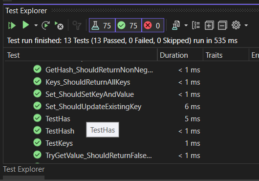

# challenge (31) : Hash Tables :Mapping Repeating Words 
## explanation
 the code demonstrates the Implemintationn for the Hash Tables And if you give it an string(sentance) it will find the the first word that is repeated  .

 

## Step by step explanation:
1. **Input Validation:**
   - The method starts by checking if the input string is null or empty using `string.IsNullOrWhiteSpace(input)`. If the input is null or empty, it throws an `ArgumentException` with an appropriate error message.

2. **Splitting the Input String:**
   - The method calls the `SplitStringIntoWords` private method to split the input string into a list of words. This method iterates through the characters of the input string and separates words based on whitespace or punctuation characters.

3. **Word Frequency Tracking:**
   - A custom hash table called `wordFrequencyTable` is created to store the frequency of each word encountered in the input string. The key in this table is the lowercase version of each word, and the value is the count of occurrences of that word.

4. **Iterating Through Words:**
   - The code then enters a loop to iterate through the list of words obtained from the input string.

5. **Lowercasing the Word:**
   - Inside the loop, each word is converted to lowercase using `string.ToLower()`. This is done to ensure that the comparison is case-insensitive.

6. **Checking for Repeated Words:**
   - It checks if the lowercase version of the current word is already present in the `wordFrequencyTable` using `wordFrequencyTable.ContainsKey(lowercaseWord)`.
   
   - If the word is already present in the table, it means that it's a repeated word, so the method returns this word immediately.

7. **Adding the Word to the Frequency Table:**
   - If the current word is not already in the table, it adds it to the `wordFrequencyTable` with a count of 1 using `wordFrequencyTable.Add(lowercaseWord, 1)`.

8. **Continuing the Loop:**
   - The loop continues to process the next word in the input string.

9. **Returning `null`:**
   - If the loop completes without finding any repeated words, the method returns `null` to indicate that there are no repeated words in the input string.

10. **End of Method:**
    - The method has now completed its processing, and the result is either a repeated word or `null`.
     
