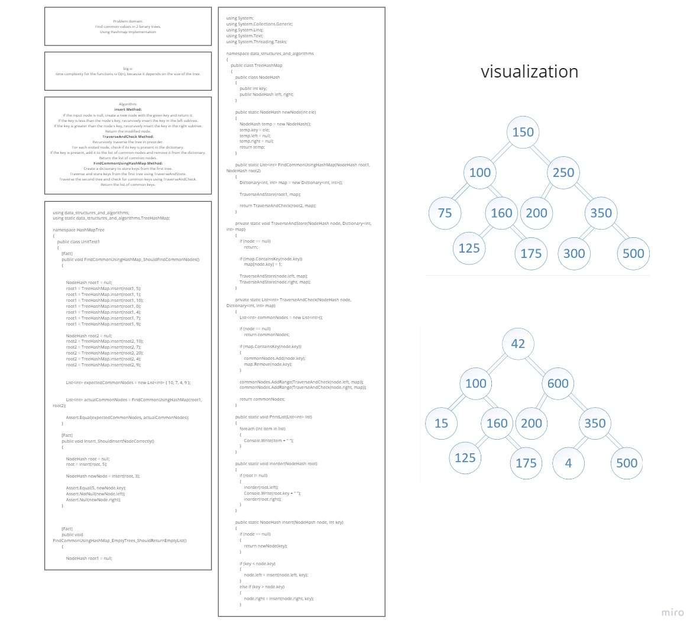
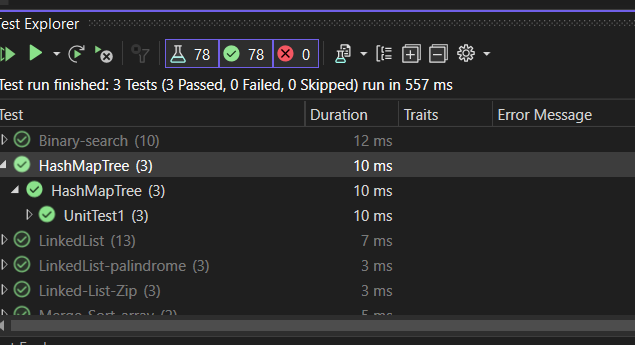

# challenge (32): Tree Intersection
## Explanation
 the code demonstrates the implementation of hashMap on two binary trees  to find the common  nodes in the tree.

 

## Step by step explanation:

1. **Node Class**:
   - The program defines a `Node` class to represent the nodes of the binary search tree (BST). Each `Node` has an integer `key`, a reference to its left child (`left`), and a reference to its right child (`right`).

2. **newNode Function**:
   - The `newNode` function creates a new `Node` with the given integer value and initializes its `left` and `right` references to `null`. It returns the newly created `Node`.

3. **insert Function**:
   - The `insert` function is used to insert a new node with a given key into a BST. It recursively traverses the tree and inserts the new node at the appropriate position based on the key.

4. **TraverseAndStore Function**:
   - This function recursively traverses the first tree (rooted at `root1`) and stores its node values in a `Dictionary<int, int> map`. The dictionary is used to keep track of the nodes visited in the first tree.

5. **TraverseAndCheck Function**:
   - This function recursively traverses the second tree (rooted at `root2`) and checks if the node's key exists in the `map`. If it does, the node's key is added to a `List<int>` called `commonNodes`, and the key is removed from the `map`. This way, it identifies common nodes between the two trees.

6. **FindCommonUsingHashMap Function**:
   - This function is the main logic for finding common nodes between two BSTs. It first initializes an empty `Dictionary<int, int> map`. Then, it calls `TraverseAndStore` to populate the `map` with nodes from the first tree. Next, it calls `TraverseAndCheck` on the second tree, which identifies and adds common nodes to the `commonNodes` list.

7. **PrintList Function**:
   - This function takes a list of integers (`commonNodes`) as input and prints its elements one by one separated by spaces.

8. **in order Function**:
   - This is a utility function that performs an inorder traversal of a BST. It prints the keys of the nodes in sorted order.

9. **Main Function**:
   - In the `Main` function:
      - Two BSTs (`root1` and `root2`) are created and populated with values.
      - The keys of the nodes in both trees are printed using the `inorder` function.
      - The common nodes between the two trees are found using the `FindCommonUsingHashMap` function.
      - The common nodes are printed using the `PrintList` function.

 
## test:
