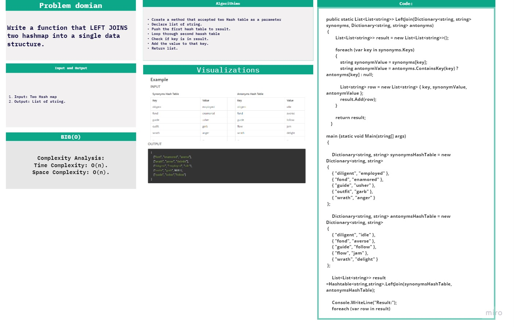
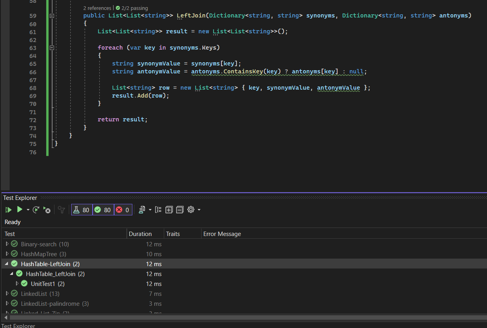

# challenge (32) : LeftJoin
## explanation
Write a function that LEFT JOINs two hashmaps into a single data structure.

 

## Algorithm
Step 1: Initialize Result List
Initialize an empty list of lists called result to store the joined data.
Step 2: Iterate Through synonyms
For each key-value pair in the synonyms dictionary:
Get the synonymValue associated with the current key in the synonyms dictionary.
Step 3: Check for Antonyms
Check if the current key exists in the antonyms dictionary:
If it exists, set antonymValue to the corresponding value in the antonyms dictionary.
If it doesn't exist, set antonymValue to null.
Step 4: Create Row
Create a new list called row containing three elements:
The current key.
The synonymValue obtained from synonyms.
The antonymValue determined in step 3.
Step 5: Append to Result
Append the row list to the result list, forming a row of joined data.
Step 6: Repeat for All Pairs
Repeat steps 2-5 for all key-value pairs in the synonyms dictionary.
Step 7: Return Result
Return the result list containing lists of keys, synonym values, and antonym values for each key in the synonyms dictionary.

 
## test: