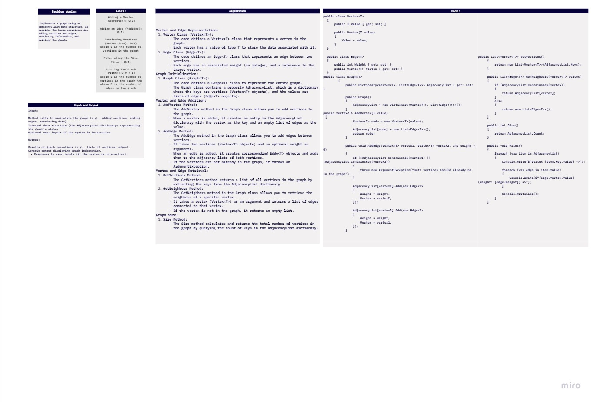
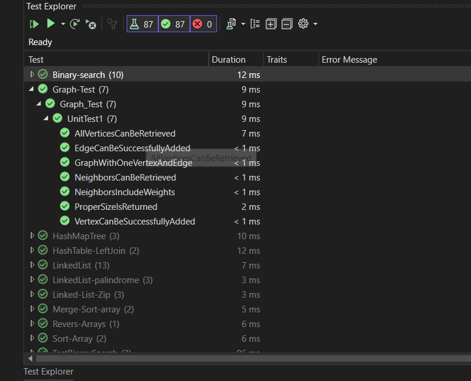

# challenge (33) : 
## explanation
Implement your own Graph. The graph should be represented as an adjacency list, and should include the following methods:

 

## Algorithm
# Graph Implementation

This C# code provides a simple implementation of a graph with algorithms for Depth First Search (DFS) and Breadth First Search (BFS). The implementation includes classes for `Graph`, `Vertex`, and `Edge`.
Algorithm AddVertex(value):
1. Create a new vertex with the given value.
2. Add the vertex to the graph's adjacency list with an empty list of edges.
3. Return the newly created vertex.
Algorithm AddEdge(vertex1, vertex2, weight):
1. Check if both vertex1 and vertex2 are already in the graph's adjacency list. If not, throw an ArgumentException.
2. Create a new edge with the specified weight and vertex2.
3. Add the new edge to the adjacency list of vertex1.
4. Create another new edge with the same weight and vertex1.
5. Add the second edge to the adjacency list of vertex2.
Algorithm GetVertices():
1. Retrieve all keys (vertices) from the adjacency list of the graph.
2. Return the list of vertices.
1. Algorithm GetNeighbors(vertex):
1. Check if the given vertex is in the adjacency list.
2. If it is, return the list of edges (neighbors) associated with the vertex.
3. If it's not, return an empty list.
1. Algorithm Print():
1. For each vertex in the graph's adjacency list:
   a. Print the vertex value.
   b. For each edge connected to the vertex, print the connected vertex value and edge weight.
   c. Move to the next line.
 
## test: