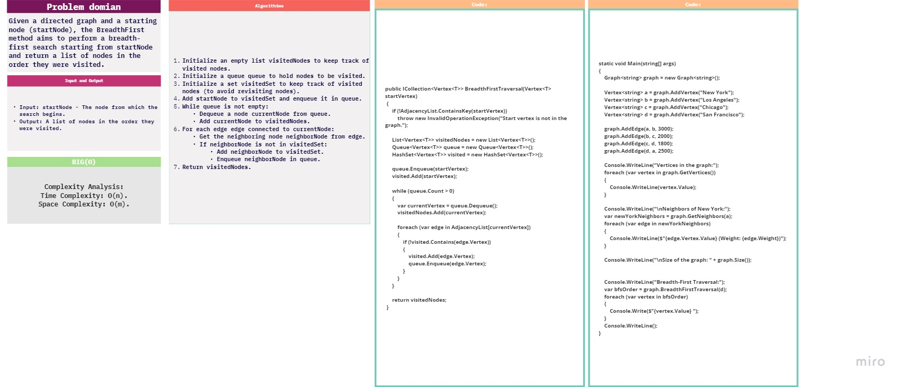
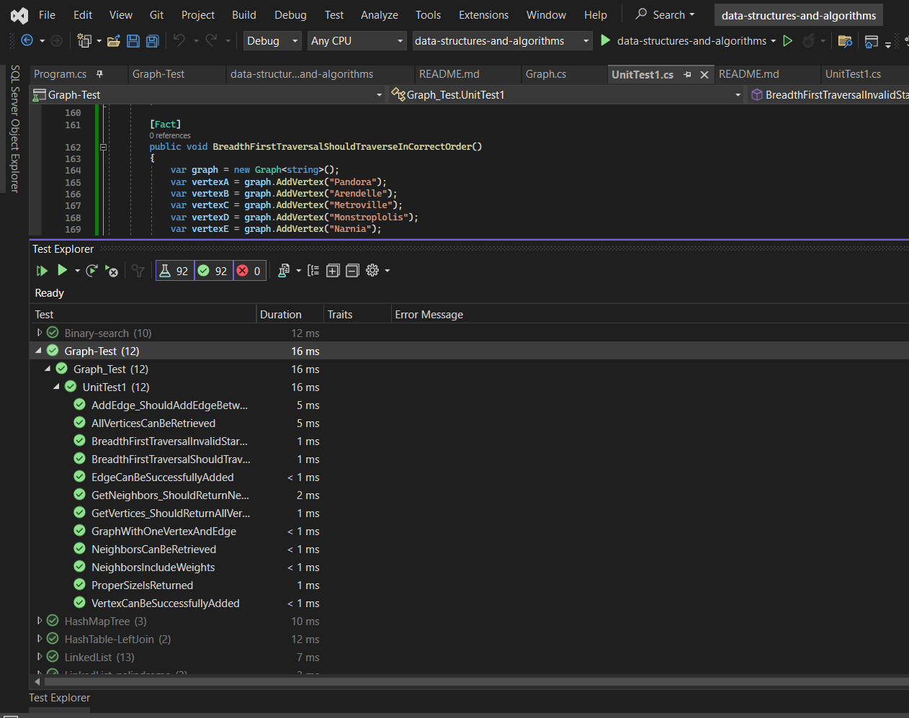

# challenge (34) : 
## explanation
Implement a breadth-first traversal on a graph.

## Algorithm
# Graph-breadth-first Implementation
Initialize an empty list visitedNodes to keep track of visited nodes.
Initialize a queue queue to hold nodes to be visited.
Initialize a set visitedSet to keep track of visited nodes (to avoid revisiting nodes).
Add startNode to visitedSet and enqueue it in queue.
While queue is not empty:
Dequeue a node currentNode from queue.
Add currentNode to visitedNodes.
For each edge edge connected to currentNode:
Get the neighboring node neighborNode from edge.
If neighborNode is not in visitedSet:
Add neighborNode to visitedSet.
Enqueue neighborNode in queue.
Return visitedNodes.

 
## test: