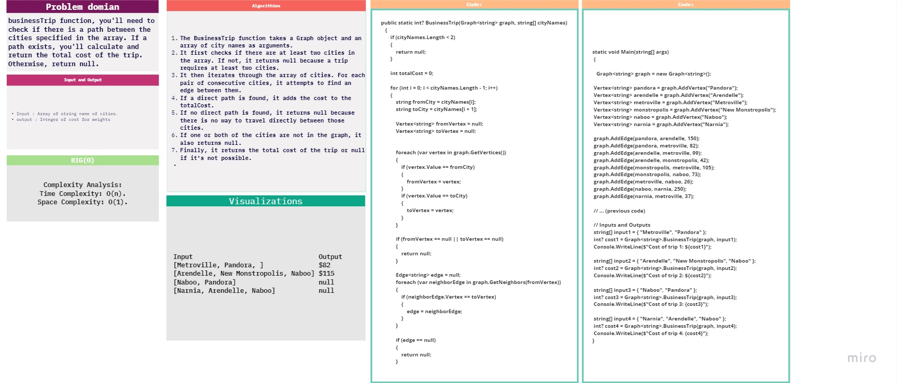
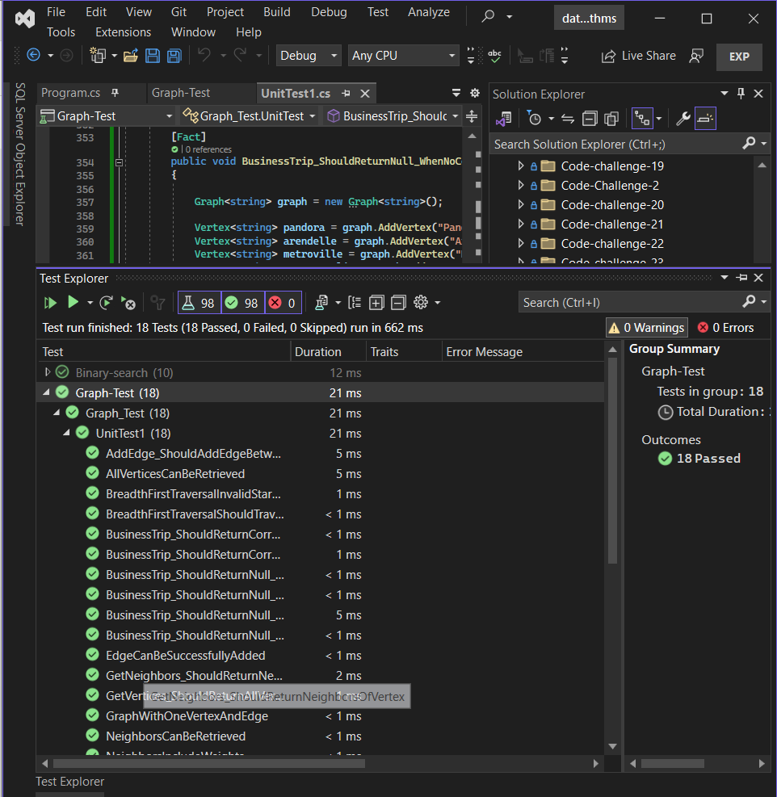

# challenge (35) : 
## explanation
Implement  graph trip business.

 

## Algorithm
The BusinessTrip function takes a Graph object and an array of city names as arguments.
It first checks if there are at least two cities in the array. If not, it returns null because a trip requires at least two cities.
It then iterates through the array of cities. For each pair of consecutive cities, it attempts to find an edge between them.
If a direct path is found, it adds the cost to the totalCost.
If no direct path is found, it returns null because there is no way to travel directly between those cities.
If one or both of the cities are not in the graph, it also returns null.
Finally, it returns the total cost of the trip or null if it's not possible.

 
## test: