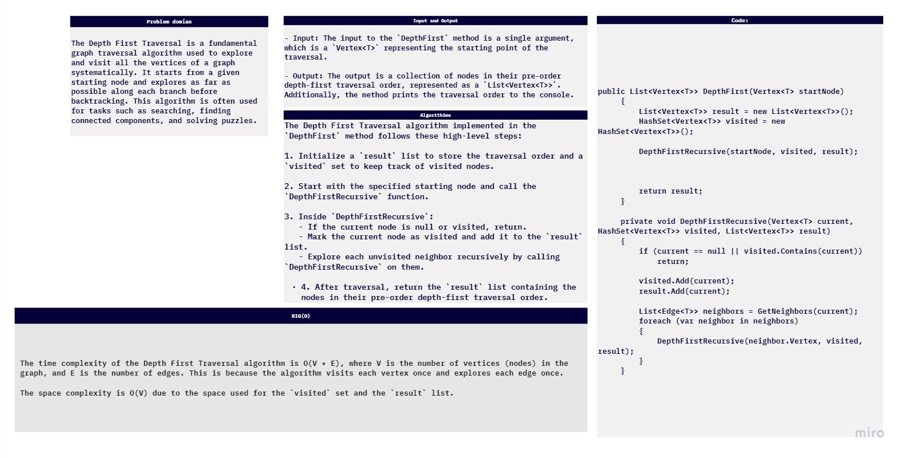

# challenge (36) : 
## explanation
Implement  graph-Depth.

 

## Algorithm
The Depth First Traversal algorithm implemented in the `DepthFirst` method follows these high-level steps:

1. Initialize a `result` list to store the traversal order and a `visited` set to keep track of visited nodes.

2. Start with the specified starting node and call the `DepthFirstRecursive` function.

3. Inside `DepthFirstRecursive`:
   - If the current node is null or visited, return.
   - Mark the current node as visited and add it to the `result` list.
   - Explore each unvisited neighbor recursively by calling `DepthFirstRecursive` on them.

4. After traversal, return the `result` list containing the nodes in their pre-order depth-first traversal order.

 
## test: